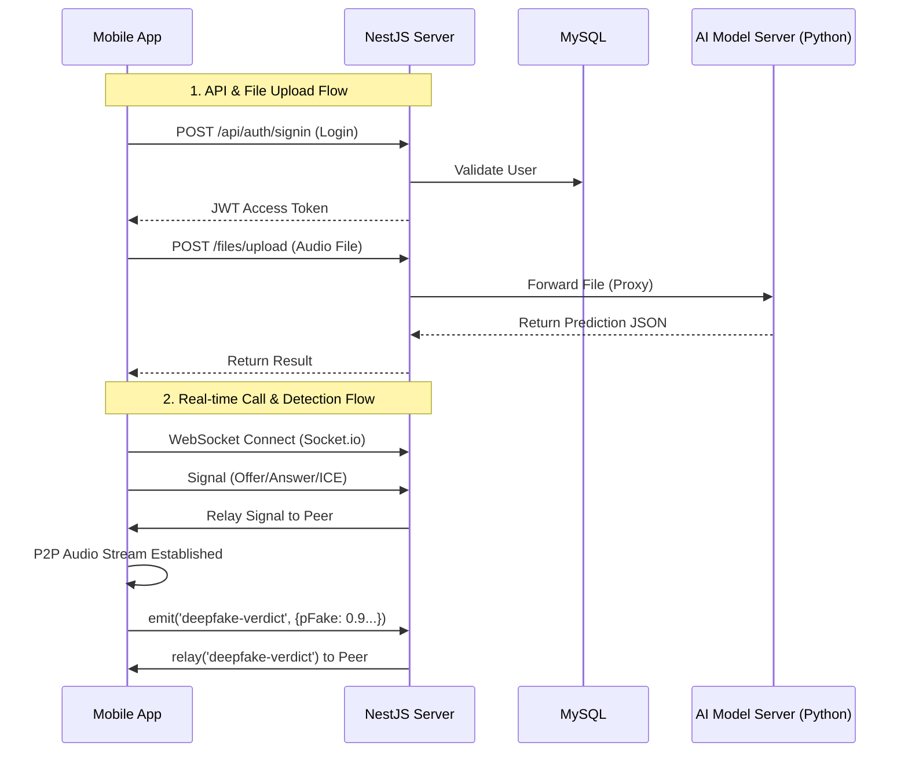

# 🛡️ DeepVoice Shield - Service Backend

> **Core Backend Server** > 딥보이스 탐지 서비스의 API, WebRTC 시그널링, AI 모델 연동을 담당하는 메인 서버


## 📌 Project Overview
이 프로젝트는 **DeepVoice Shield** 모바일 앱과 AI 모델 사이를 연결하는 **중추적인 백엔드 서버**입니다.
RESTful API를 통한 회원/게시판 관리뿐만 아니라, 실시간 통화를 위한 **WebRTC 시그널링**과 딥보이스 탐지 결과를 중계하는 **WebSocket Gateway** 역할을 수행합니다.

### 🔑 Key Features
1. **User Authentication**: JWT 기반 인증, 비밀번호 암호화(Bcrypt), 역할(Role) 기반 권한 관리.
2. **WebRTC Signaling**: 1:1 통화를 위한 P2P 연결 정보(Offer, Answer, ICE Candidate) 중계.
3. **Deepfake Verdict Relay**: 송신측(또는 AI)에서 분석된 딥보이스 확률 정보를 수신측에게 실시간 전달.
4. **ML Server Proxy**: 앱에서 업로드한 음성 파일을 AI 추론 서버(FastAPI)로 전달하고 결과 반환.
5. **Dashboard API**: 공지사항 및 커뮤니티 기능을 위한 게시판 CRUD.

## 🚀 System Architecture


## 📂 Directory Structure
```bash
src
├── common          # 공통 사용 모듈 (DTO, Entities, Filters, Interceptors, Pipes)
├── configs         # TypeORM 등 설정 파일
├── modules
│   ├── audio       # [Core] WebSocket Gateway (Signaling & Verdict Relay)
│   ├── auth        # JWT 인증 및 가드(Guard)
│   ├── dashboard   # 게시판 CRUD
│   ├── files       # 파일 업로드 및 ML 서버 프록시
│   └── users       # 사용자 관리
└── main.ts         # Entry Point
```

## 🛠️ Environment Setup (.env)
루트 디렉토리에 `.env` 파일을 생성하고 아래 변수들을 설정해주세요.
```bash
# Server
PORT=3000

# Database (MySQL)
DB_HOST=localhost
DB_PORT=3306
DB_USER=root
DB_PW=your_password
DB_NAME=deepvoice_db

# JWT Auth
JWT_SECRET=your_secret_key
JWT_EXPIRATION=3600s

# AI Model Server (FastAPI) Connection
ML_URL=[http://127.0.0.1:8000](http://127.0.0.1:8000)
ML_PREDICT_PATH=/predict
ML_TIMEOUT_MS=60000
```

## 🚀 Getting Started
### 1. Installation
```bash
npm install
```

### 2. Database Setup
MySQL 데이터베이스를 생성합니다. (TypeORM synchronize: true 설정으로 인해 테이블은 자동 생성됩니다.)
```bash
CREATE DATABASE deepvoice_db;
```

### 3. Run Server
```bash
# Development mode
npm run start:dev

# Production mode
npm run build
npm run start:prod
```

## 📡 API Documentation
### Auth & Users
| Method | Endpoint | Description | Note |
| :--- | :--- | :--- | :--- |
| `POST` | `/api/auth/signin` | 로그인 | JWT Access Token 발급 |
| `POST` | `/api/users` | 회원가입 | 비밀번호 Bcrypt 암호화 저장 |
| `POST` | `/api/users/reset-password` | 비밀번호 재설정 | 이메일/ID 확인 후 변경 |
| `PUT` | `/api/users/:id` | 회원 정보 수정 | 비밀번호, 닉네임 등 |
| `DELETE` | `/api/users/:id` | 회원 탈퇴 | - |

### Dashboard (Board)
| Method | Endpoint | Description | Note |
| :--- | :--- | :--- | :--- |
| `GET` | `/api/dashboard` | 전체 게시글 조회 | 최신순 정렬 |
| `POST` | `/api/dashboard` | 게시글 작성 | **Auth Required** (Header) |
| `GET` | `/api/dashboard/mydashboard` | 내 게시글 조회 | **Auth Required** |
| `GET` | `/api/dashboard/:id/detail` | 게시글 상세 조회 | - |
| `PUT` | `/api/dashboard/:id` | 게시글 수정 | 본인 작성글만 가능 |
| `DELETE` | `/api/dashboard/:id` | 게시글 삭제 | 본인 작성글만 가능 |
| `GET` | `/api/dashboard/search` | 게시글 검색 | Query: `?keyword={title}` |

### Files (AI Inference)
| Method | Endpoint | Description | Payload |
| :--- | :--- | :--- | :--- |
| `POST` | `/files/upload` | 음성 파일 분석 요청 | `multipart/form-data` (file) |

## 🔌 WebSocket Events (Socket.io)

**Namespace:** `/` (Default)

### Signaling (WebRTC)
| Event Name | Direction | Description | Payload Example |
| :--- | :---: | :--- | :--- |
| `register-user` | Client → Server | 소켓 ID와 전화번호 매핑 | `{ phoneNumber: "010-..." }` |
| `call` | Client → Server | 상대방에게 통화 요청 | `{ to: "010-...", from: "..." }` |
| `offer` | Client ↔ Server | WebRTC Offer 교환 | `{ type: "offer", sdp: ... }` |
| `answer` | Client ↔ Server | WebRTC Answer 교환 | `{ type: "answer", sdp: ... }` |
| `ice` | Client ↔ Server | ICE Candidate 교환 | `{ candidate: ... }` |
| `hangup` | Client → Server | 통화 종료 알림 | `{ to: "010-..." }` |

### Deepfake Detection Relay
| Event Name | Direction | Description | Payload Example |
| :--- | :---: | :--- | :--- |
| `deepfake-verdict` | Client ↔ Server | 딥보이스 확률 정보 실시간 중계 | `{ pFake: 0.98, pReal: 0.02 }` |


## 🔌 WebSocket Events (Socket.io)
**Namespace: /**

### Signaling (WebRTC)
+ register-user: 사용자 전화번호 등록 (SocketID 매핑)

+ call: 상대방에게 통화 요청

+ offer, answer, ice: WebRTC 연결 협상 데이터 교환

hangup: 통화 종료

### Deepfake Detection
+ deepfake-verdict: (Send/Receive)

  + 실시간으로 분석된 딥페이크 확률(pFake, pReal)을 상대방 소켓으로 중계합니다.

  + 서버는 이 데이터를 저장하지 않고 즉시 전달(Relay)만 수행합니다.

## 🔗 Related Repositories
+ Backend: [deepfake_detection_service_backend](https://github.com/thisNorm/deepfake_detection_service_backend.git)

+ Frontend (Landing): [deepfake_detection_service_frontend](https://github.com/thisNorm/deepfake_detection_service_frontend.git)

+ Algorithm: [deepfake_detection_service_algorithm](https://github.com/thisNorm/deepfake_detection_service_algorithm.git)
